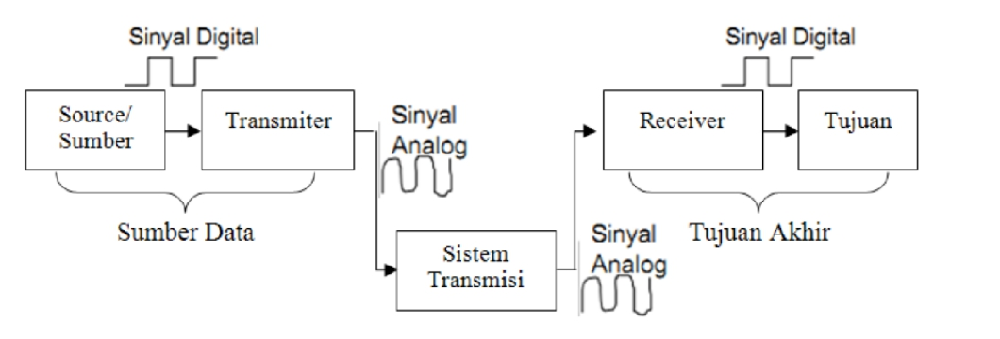
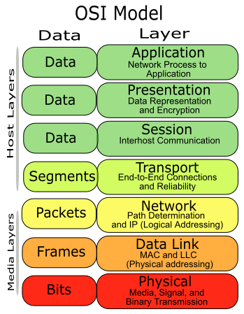

# 1. Jaringan Komputer

## Outline
  *  [1\. Jaringan Komputer](#1-Jaringan-Komputer)

     * [Outline](#outline)
     * [1.1 Konsep](#11-konsep)
        
        * [1.1.1 Pendahuluan](#111-pendahuluan)
        * [1.1.2 Apa itu jaringan komputer?](#112-Apa-itu-jaringan-komputer)
        * [1.1.3 Komunikasi data](#113-komunikasi-data)
        * [1.1.4 Osi Layer](#114-osi-layer)
     * [1.2 Referensi](#referensi)

## 1.1 Konsep
### 1.1.1 Pendahuluan
Jaringan komputer saat ini sudah menjadi kebutuhan banyak pihak, mulai dari instansi pendidikan hingga perusahaan. Jaringan komputer memberikan kemudahan antar pengguna komputer, dengan adanya jaringan komputer, transformasi data antar komputer dapat dilakukan dengan mudah dan cepat. Oleh karena itu efektifitas dan efisiensi bisa dicapai yang akhirnya produktifitas lebih tinggi.

### 1.1.2 Apa itu jaringan komputer?
Jaringan komputer adalah sebuah sistem yang terdiri atas komputer, software, dan perangkat jaringan yang bekerja sama untuk mencapai suatu tujuan yang sama. Agar dapat mencapai tujuan yang sama, setiap bagian dari jaringan komputer meminta dan memberikan layanan(service). Pihak yang meminta/menerima layanan disebut client dan yang memberikan layanan disebut server. Arsitektur ini disebut dengan sistem client-server dan digunakan pada hampir seluruh aplikasi jaringan komputer. Jaringan komputer dapat dikatakan  terkoneksi  apabila  device yang ada dalam jaringan tersebut  bisa  saling  bertukar  data/informasi dan berbagi resource yang dimiliki. 

### 1.1.3 Komunikasi data

Komunikasi data erat kaitannya dengan jaringan komputer. Istilah "Komunikasi data" berhubungan dengan pengiriman data menggunakan sistem transmisi elektronika dari satu komputer ke komputer yang lain ataupun ke terminal tertentu. Data yang dimaksud adalah sinyal-sinyal elektromagnetik yang dibangkitkan oleh sumber data (transmitter) yang diterima dan dikirimkan kepada terminal-terminal penerima (reveiver). Contoh dari terminal-terminal tersebut adalah peralatan elektronik seperti printer, keyboard, telepon, fax, dll.

### 1.1.5 OSI Layer

Pada sebuah jaringan komputer, kehadiran protokol sangat penting untuk menghubungkan antara satu komputer dengan komputer lainnya. Tanpa adanya protokol, maka komputer-komputer tersebut tidak akan bisa saling bertukar informasi.

Protokol jaringan komputer adalah aturan yang ada dalam sebuah jaringan komputer yang harus ditaati oleh pihak pengirim dan penerima agar dapat saling berkomunikasi dan bertukar informasi meskipun memiliki sistem yang berbeda.

Ketika ISO (International Standart Organization) membuat standarisasi protokol, maka terciptalah sebuah standar model referensi yang berisi cara kerja protokol. Model referensi yang kemudian disebut dengan Open System Interconnection (OSI). 

| Lapisan ke-      | Nama Lapisan | Keterangan    |
| :---        |    :----:   |          :--- |
| 7      | Application Layer       | Merupakan layer dimana terjadi interaksi antarmuka end user dengan aplikasi yang bekerja menggunakan fungsionalitas jaringan, melakukan pengaturan bagaimana aplikasi bekerja menggunakan resource jaringan, untuk kemudian memberika pesan ketika terjadi kesalahan. |
| 6  | Presentation Layer        |  Layer ini bekerja dengan mentranslasikan format data yang hendak ditransmisikan oleh aplikasi melalui jaringan, ke dalam format yang bisa ditransmisikan oleh jaringan. Pada layer ini juga data akan di-enkripsi atau di-deskripsi.  |
| 5     | Session Layer       |  Session layer akan mendefinisikan bagaimana koneksi dapat dibuat, dipelihara, atau dihancurkan. Di layer ini ada protocol Name Recognition,NFS & SMB.|
| 4  | Transport Layer        | Layer ini akan melakukan pemecahan data ke dalam paket-paket data serta memberikan nomor urut pada paket-paket data tersebut sehingga dapat disusun kembali  ketika sudah sampai pada sisi tujuan. Selain itu, pada layer ini, akan menentukan protokol yang akan digunakan untuk mentransmisi data, misalkan protokol TCP. Protokol ini akan mengirimkan paket data, sekaligus akan memastikan bahwa paket diterima dengan sukses (acknowledgement), dan mentransmisikan ulang terhadap paket-paket yang hilang atau rusak di tengah jalan. |
| 3     | Network Layer       | Network layer akan membuat header untuk paket-paket yang berisi informasi IP, baik IP pengirim data maupun IP tujuan data. Pada kondisi tertentu, layer ini juga akan melakukan routing melalui internetworking dengan menggunakan router dan switch layer-3.    |
| 2   | Data-link layer       | Befungsi untuk menentukan bagaimana bit-bit data dikelompokkan menjadi format yang disebut sebagai frame. Selain itu, pada level ini terjadi koreksi kesalahan, flow control, pengalamatan perangkat keras (seperti halnya Media Access Control Address (MAC Address)), dan menetukan bagaimana perangkat-perangkat jaringan seperti hub, bridge, repeater, dan switch layer 2 beroperasi.   |
| 1    | Physical layer      |Layer Physcal berkerja dengan mendefinisikan media transmisi jaringan, metode pensinyalan, sinkronisasi bit, arsitektur jaringan (seperti halnya Ethernet atau Token Ring), topologi jaringan dan pengabelan.  |

## Referensi

* http://www.mikrotik.co.id/artikel_lihat.php?id=59
* https://books.google.co.id/books?id=LIuACwAAQBAJ&printsec=frontcover&source=gbs_ge_summary_r&cad=0#v=onepage&q&f=false
