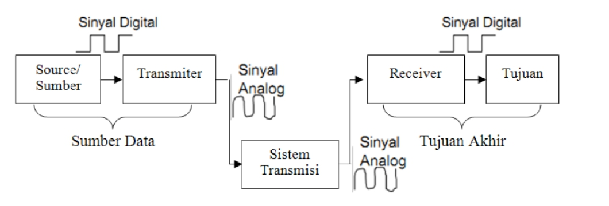
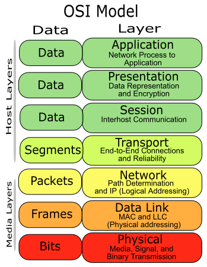

# 1. Jaringan Komputer

## Outline
  *  1\. Jaringan Komputer

     * Outline
     * 1.1 Konsep
        
        * 1.1.1 Pendahuluan
        * 1.1.2 Apa itu jaringan komputer?
        * 1.1.3 Komunikasi data
        * 1.1.4 Osi Layer
     * 1.2 Referensi

## 1.1 Konsep
### 1.1.1 Pendahuluan
Jaringan komputer saat ini sudah menjadi kebutuhan banyak pihak, mulai dari instansi pendidikan hingga perusahaan. Jaringan komputer memberikan kemudahan antar pengguna komputer, dengan adanya jaringan komputer, transformasi data antar komputer dapat dilakukan dengan mudah dan cepat. Oleh karena itu efektifitas dan efisiensi bisa dicapai yang akhirnya produktifitas lebih tinggi.

### 1.1.2 Apa itu jaringan komputer?
Jaringan komputer adalah sebuah sistem yang terdiri atas komputer, software, dan perangkat jaringan yang bekerja sama untuk mencapai suatu tujuan yang sama. Agar dapat mencapai tujuan yang sama, setiap bagian dari jaringan komputer meminta dan memberikan layanan(service). Pihak yang meminta/menerima layanan disebut client dan yang memberikan layanan disebut server. Arsitektur ini disebut dengan sistem client-server dan digunakan pada hampir seluruh aplikasi jaringan komputer. Jaringan komputer dapat dikatakan  terkoneksi  apabila  device yang ada dalam jaringan tersebut  bisa  saling  bertukar  data/informasi dan berbagi resource yang dimiliki. 

### 1.1.3 Komunikasi data

Komunikasi data erat kaitannya dengan jaringan komputer. Istilah "Komunikasi data" berhubungan dengan pengiriman data menggunakan sistem transmisi elektronika dari satu komputer ke komputer yang lain ataupun ke terminal tertentu. Data yang dimaksud adalah sinyal-sinyal elektromagnetik yang dibangkitkan oleh sumber data (transmitter) yang diterima dan dikirimkan kepada terminal-terminal penerima (reveiver). Contoh dari terminal-terminal tersebut adalah peralatan elektronik seperti printer, keyboard, telepon, fax, dll.

### 1.1.5 OSI Layer

Pada sebuah jaringan komputer, kehadiran protokol sangat penting untuk menghubungkan antara satu komputer dengan komputer lainnya. Tanpa adanya protokol, maka komputer-komputer tersebut tidak akan bisa saling bertukar informasi.

Protokol jaringan komputer adalah aturan yang ada dalam sebuah jaringan komputer yang harus ditaati oleh pihak pengirim dan penerima agar dapat saling berkomunikasi dan bertukar informasi meskipun memiliki sistem yang berbeda.

Ketika ISO (International Standart Organization) membuat standarisasi protokol, maka terciptalah sebuah standar model referensi yang berisi cara kerja protokol. Model referensi yang kemudian disebut dengan Open System Interconnection (OSI). 

